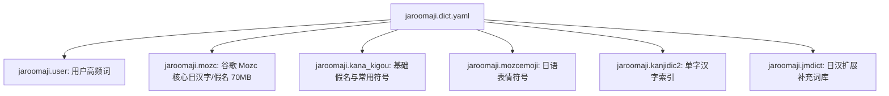

# Rime 日本語ローマ字 (jaroomaji) 使用与进阶配置指南

本文档全面介绍 `jaroomaji`（日本語ローマ字）方案的输入规则、快捷键转换、动态词频机制及自定义词库管理。

---

## 1. 方案特性概览

* **极速双方案切换**：随时通过 **`Option + Space`**（或 `Ctrl + Space`）在 **中文 (sbzr)** 与 **日本語 (jaroomaji)** 之间零等待瞬间直切。
* **双模长音支持**：输入长音符（ー）既可以使用标准减号键 `-`，也可以直接按 **`l` 键**（例如 `to-kyo-` 或 `tolkyol` 均可输出 `東京` / `トウキョウ`）。
* **强制片假名模式**：按住 **`Shift`** 键输入任意罗马字，直接强制输出对应全角片假名（カタカナ）。
* **动态词频记忆**：全面接入 `dynamic_freq` 记忆引擎，打过的日文人名、常用语和汉字优先置顶。

---

## 2. 常用假名与全半角极速转换快捷键

在输入罗马字（未按回车上屏前），可直接使用以下标准快捷键快速转换字符形态：

| 快捷键 | 替代快捷键 | 转换目标 | 示例 (输入 `toukyou`) |
| :--- | :--- | :--- | :--- |
| **`F6`** | **`Ctrl + U`** | **全角平假名** (Hiragana) | `とうきょう` |
| **`F7`** | **`Ctrl + I`** | **全角片假名** (Katakana) | `トウキョウ` |
| **`F8`** | **`Ctrl + O`** | **半角片假名** (Half Katakana)| `ﾄｳｷｮｳ` |
| **`F10`** | **`Ctrl + P`** | **原始英数** (Raw ASCII) | `toukyou` |
| **`Shift + BackSpace`**| — | **清空当前输入** (Escape) | 清空未上屏内容 |

---

## 3. 一键添加日语自定义词库 (`./add-word --jp`)

你可以使用 `./add-word` 工具将个人常用的日语敬语、专有名词、人名或特殊缩写一键写入日语用户词库：

### 3.1 语法
```bash
./add-word <日语词条> <罗马音编码> [权重] --jp
```

### 3.2 示例
```bash
# 常用敬语
./add-word "お疲れ様です" otsukaresamadesu --jp
./add-word "よろしくお願いします" yoroshiku --jp

# 机构 / 大学 / 地名
./add-word "東京大学" toukyoudaigaku --jp

# 带有特殊长音或空格的词条
./add-word "ラーメン" "ra - me nn" --jp
```

### 3.3 存储位置与生效
* **存储词典**：`sbzr.chrome.extension/dicts.jp/jaroomaji.user.dict.yaml`（基准高权重 `88888`）。
* **编译生效**：运行 `./rebuild` 即可立即生效。

---

## 4. 日语词库架构与同步体系



* **自动拉取与补全**：当在新设备拉取配置时，Git Hook（`.githooks/post-merge`）和 `./pull` 会自动检测并从官方源下载 `dicts.jp/` 下缺失的全部词库，无需手动配置。
* **本地与多端词频**：你在日语模式下的选词历史会自动记录到 `dynamic_freq.local.txt` 并通过 Git 同步到你的所有设备。

---

## 5. 常见日语输入对照表 (特殊音节)

| 假名 | 推荐输入键 | 备用输入键 |
| :--- | :--- | :--- |
| **促音 (っ)** | 双写声母（如 `kitte` -> `きって`） | `ltu` / `xtu` |
| **拨音 (ん)** | `nn` / 单词末尾单按 `n` | `xn` |
| **拗音 (しゃ/ちゃ/じゃ)** | `sya` / `tya` / `zya` | `sha` / `cha` / `ja` |
| **小写假名 (ぁ/ぃ/ぅ/ぇ/ぉ)** | `xa` / `xi` / `xu` / `xe` / `xo` | `la` / `li` / `lu` / `le` / `lo` |
| **长音符 (ー)** | `-` (减号) 或 **`l`** (字母 L) | — |
