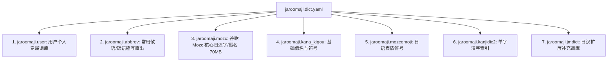

# Rime 日本語ローマ字 (jaroomaji) 使用与进阶配置指南

本文档全面介绍 `jaroomaji`（日本語ローマ字）方案的输入规则、快捷键转换、动态词频机制及自定义词库管理。

---

## 1. 方案特性概览

* **极速双方案切换**：随时通过 **`Option + Space`**（或 `Ctrl + Space`）在 **中文 (sbzr)** 与 **日本語 (jaroomaji)** 之间零等待瞬间直切。
* **双模长音支持**：输入长音符（ー）既可以使用标准减号键 `-`，也可以直接按 **`l` 键**（例如 `to-kyo-` 或 `tolkyol` 均可输出 `東京` / `トウキョウ`）。
* **强制片假名模式**：按住 **`Shift`** 键输入任意罗马字，直接强制输出对应全角片假名（カタカナ）。
* **动态词频记忆**：全面接入 `dynamic_freq` 记忆引擎，打过的日文人名、常用语和汉字优先置顶。

---

## 2. 常用假名与全半角极速转换快捷键

在输入罗马字（未按回车上屏前），可直接使用以下标准快捷键快速转换字符形态：

| 快捷键 | 替代快捷键 | 转换目标 | 示例 (输入 `toukyou`) |
| :--- | :--- | :--- | :--- |
| **`F6`** | **`Ctrl + U`** | **全角平假名** (Hiragana) | `とうきょう` |
| **`F7`** | **`Ctrl + I`** | **全角片假名** (Katakana) | `トウキョウ` |
| **`F8`** | **`Ctrl + O`** | **半角片假名** (Half Katakana)| `ﾄｳｷｮｳ` |
| **`F10`** | **`Ctrl + P`** | **原始英数** (Raw ASCII) | `toukyou` |
| **`Shift + BackSpace`**| — | **清空当前输入** (Escape) | 清空未上屏内容 |

---

## 3. 日语智能前缀预测与自动补完 (Predictive Completion)

输入法内置了针对日语的 **Lua 智能预测补全器**：

* **核心手感**：
  * 第 1 候选：保留精确当前平假名（不打扰正常拼写）；
  * **第 2、3 候选**：自动提取以当前输入为前缀的超长高频短语/敬语，并附带 **`〔予測〕`** 标识。
* **极速输入示例**：
  * 输入 **`ariga`** ➔ 候选 2 自动预测 **`ありがとう`**，候选 3 自动预测 **`ありがとうございます`**；按数字 `2` 或 `3` 即可秒出！
  * 输入 **`otsu`** ➔ 候选 2 自动预测 **`お疲れ様です`**，候选 3 **`お疲れ様でした`**。
  * 输入 **`yoro`** ➔ 候选 2 自动预测 **`よろしくお願いします`**。
  * 输入 **`sumi`** ➔ 候选 2 自动预测 **`すみません`**。

---

## 4. 日语独立缩写与敬语词库 (`jaroomaji.abbrev.dict.yaml`)

为了便于维护与自定义，系统将所有高频短语/敬语缩写独立存放于：
📁 `sbzr.chrome.extension/dicts.jp/jaroomaji.abbrev.dict.yaml`

### 4.1 内置高频缩写速查表

| 输入缩写 | 输出短语 |
| :--- | :--- |
| **`ots`** / **`otsd`** | `お疲れ様です` / `お疲れ様でした` |
| **`yoro`** | `よろしくお願いいたします` / `よろしくお願いします` |
| **`arig`** / **`arigo`** | `ありがとう` / `ありがとうございます` |
| **`ohayo`** / **`kon`** | `おはようございます` / `こんにちは` |
| **`sumi`** / **`mousi`** | `すみません` / `申し訳ございません` |
| **`ose`** / **`ituose`** | `お世話になっております` / `いつもお世話になっております` |
| **`syou`** / **`kasi`** | `承知いたしました` / `かしこまりました` |
| **`situ`** / **`situd`** | `失礼いたします` / `失礼いたしました` |
| **`kaku`** / **`kakuyoro`** | `ご確認ください` / `ご確認よろしくお願いいたします` |
| **`dai`** / **`mond`** | `大丈夫です` / `問題ありません` |

---

## 5. 一键添加日语自定义词库 (`./add-word --jp`)

你可以使用 `./add-word` 工具将个人专属的日语敬语、专有名词或人名一键写入日语用户词库：

### 5.1 语法
```bash
./add-word <日语词条> <罗马音编码> [权重] --jp
```

### 5.2 示例
```bash
# 常用短语
./add-word "お疲れ様です" otsukaresamadesu --jp
./add-word "東京大学" toukyoudaigaku --jp

# 带有特殊长音或空格的词条
./add-word "ラーメン" "ra - me nn" --jp
```

* **存储位置**：`sbzr.chrome.extension/dicts.jp/jaroomaji.user.dict.yaml`。
* **编译生效**：运行 `./rebuild` 即可生效。

---

## 6. 日语词库分层架构体系



* **独立维护性**：`jaroomaji.user` 和 `jaroomaji.abbrev` 均为纯净的 YAML 文件，互不干扰，支持 Git 多设备无缝同步。
