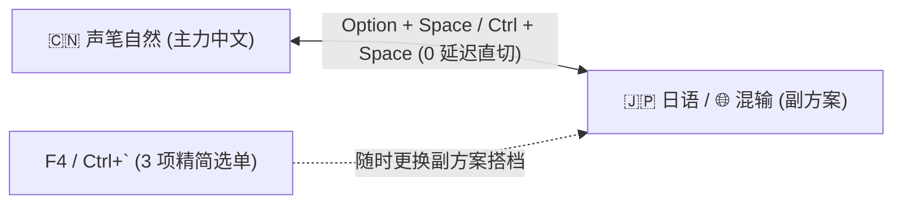
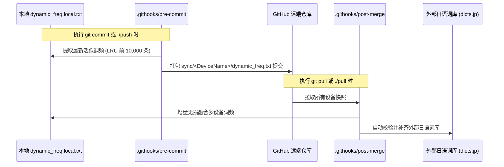

# Rime 声笔自然 (sbzr) 进阶使用与维护指南

本文档汇总了 Rime 输入法方案的最新交互架构、快捷造词工具、多设备词频同步机制及日常维护命令。

---

## 1. 方案极速切换体系 (A ⇄ B 双方案往返直切)

为了避免在多个大型词库之间链式轮切引发的卡顿与重入死锁，系统采用 **“主力 ⇄ 副力 1 对 1 往返秒切”** 架构：



### 1.1 快捷键定义

| 快捷键 | 功能 | 说明 |
| :--- | :--- | :--- |
| **`Option + Space`** | **A ⇄ B 往返秒切** | 在中文主方案与最近使用的副方案（混输/日语）间瞬间跳切，**0 选单、0 等待** |
| **`Ctrl + Space`** | **A ⇄ B 往返秒切** | 同 `Option + Space`，满足不同键盘手势偏好 |
| **`F4`** 或 **`Ctrl + \``** | **呼出 3 项方案选单** | 显示 `1. 声笔自然 2. 混输模式 3. 日本語ローマ字` |

### 1.2 常用工作流示例
1. **中文与日语往返**：
   * 当前在中文 ➔ 按 `Option + Space` ➔ **直接进入日语** ➔ 打完按 `Option + Space` ➔ **直接回退到中文**。
2. **更换副方案搭档**：
   * 如果想从日语改为混输，按 `F4`（或 `Ctrl + \``），按 `2` 选一次“混输模式”；
   * 此后 `Option + Space` 自动记忆为 **`中文 ⇄ 混输`** 的双向往返。

---

## 2. 一键快捷造词 CLI 工具 (`./add-word`)

项目内置了声笔自然编码公式的快速造词工具，无需手动查双拼或编辑 YAML 文件。

### 2.1 命令语法
```bash
./add-word <词条> [自定义编码] [权重]
```

### 2.2 常见用法示例

* **自动计算中文声笔自然编码**（基准权重 `2000`）：
  ```bash
  ./add-word "人工智能"
  # 输出: 编码 rgzn，权重 2000，写入 sbzr.shortcut.dict.yaml
  ```
  ```bash
  ./add-word "机器学习"
  # 输出: 编码 jqxx，权重 2000
  ```

* **自定义英文短语 / 缩写**：
  ```bash
  ./add-word "Neovim" nvim
  ./add-word "GitHub" gh
  ```

* **指定高优先级权重**：
  ```bash
  ./add-word "无损同步" wstb 2500
  ```

### 2.3 重新编译生效
添加完成后，运行以下命令即可生效：
```bash
./rebuild
```

---

## 3. 多设备动态调频与 LRU 滚动归档

输入法能够跨设备（Mac、Linux、新电脑）自动同步个人的动态选词习惯。

### 3.1 核心流程图


### 3.2 LRU 容量健康管理
* **默认上限**：每个快照和本地缓存最多保留 **10,000 条** 最近且最活跃的调频记录（按更新时间戳倒序）。
* **超期归档**：历史极冷数据自动淘汰，保证 Git 仓库轻量、合并速度小于 0.05 秒。
* **自定义上限**：如需扩大容量，可在环境变量中指定 `MAX_DYNAMIC_FREQ_RECORDS=20000`。

---

## 4. 混输模式 (`sbzr_mix`) 与视觉指示器

在混输模式下，输入法自动对多语言候选词进行精准标注与排位：

* **短词优先对齐**：与主方案完全对齐，启用 `length_priority_filter`，杜绝生造长句顶飞常用词。
* **视觉标签提示**：
  * 英文单词候选：标注 **`〔英〕`**
  * 日语词汇候选：标注 **`〔日〕`**
  * 自定义/快捷词：标注 **`〔自定义〕`**
  * 中文主词条：首选呈现，干净无干扰

---

## 5. 常用维护命令速查

| 脚本 / 命令 | 说明 |
| :--- | :--- |
| **`./add-word "中文词条"`** | 一键自动派生编码并添加到中文快捷词库 |
| **`./add-word "日语词条" 罗马音 --jp`** | 一键添加到日语用户词库 (`jaroomaji.user.dict.yaml`) |
| **`./pull`** | 强制从远程拉取最新配置，合并多设备词频并补齐日语词库 |
| **`./push`** | 导出本地词频快照、自动清理缓存并强制提交推送到云端 |
| **`./rebuild`** | 清理编译缓存并重新编译部署 Rime 输入法 |
| **`python3 scripts/purify_dynamic_freq.py`** | 将动态高频词提纯固化进静态词库 (`sbzr.userdb.dict.yaml`) |

---

## 6. 相关专项文档

* 🇯🇵 **日语罗马字输入专项指南**：[`documents/jaroomaji_usage_guide.md`](file:///Users/tetsuya/chezmoi/dot_local/share/rime/documents/jaroomaji_usage_guide.md)
* 🔄 **多设备动态调频同步机制**：[`documents/sbzr_dynamic_wordfreq_sync.md`](file:///Users/tetsuya/chezmoi/dot_local/share/rime/documents/sbzr_dynamic_wordfreq_sync.md)
