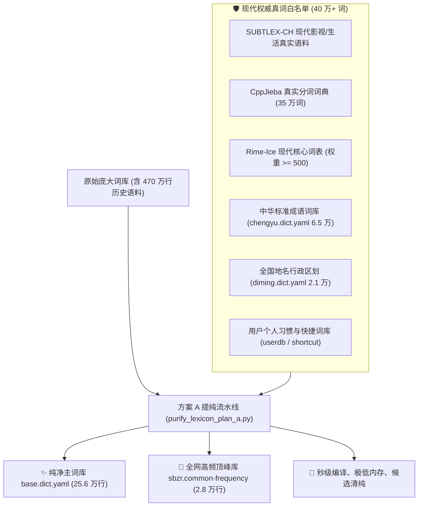

# Rime 声笔自然：词库高纯提纯体系与方案 A 指南

本文档全面记录声笔自然词库的 **“方案 A 高纯白名单提纯流水线”** 的核心原理、白名单构成、清洗标准与长期维护方法。

---

## 1. 为什么需要词库提纯？

在过去的声笔自然词库中，包含了大量历史遗留的低质语料：

1. **生僻文言与古籍死词**：如《汉书》中的古成语「`绝域殊方`」（编码 `jysf`，极其遥远之意），在现代日常与专业写作中几乎从不使用，却霸占了正常词汇的候选窗口。
2. **语料库 3 字/4 字滑动切片**：如「`单独写到`」、「`最典型的`」、「`终端下的`」、「`是到新的`」，系原始文本被机械切词产生的语法断片。
3. **机械排列组合词**：如「`井婶`」、「`景婶`」、「`经婶`」、「`荆婶`」，系姓氏与称谓暴力笛卡尔积生成的非真实词。

这些冗余切片占用了超过 **300 万行** 的体积，不仅拖慢编译速度，更严重稀释了输入法首选项的精准度。

---

## 2. 方案 A：高纯白名单提纯法 (Plan A Architecture)

方案 A 的核心准则为：**「现代真词 100% 绝对保留，非现代成词与语法切片 100% 干净剥离」**。



---

## 3. 过滤规则与分级保护标准

| 词条类型 | 处理规则 | 安全保证 | 典型词例 |
| :--- | :--- | :--- | :--- |
| **单字 (1 字)** | **100% 绝对保留** | 保证所有汉字均可单字双拼打出 | `精`、`神`、`字`、`词` |
| **双字词 (2 字)** | **100% 绝对保留** | 涵盖现代所有合法二字汉语成词 | `精神`、`经济`、`发展`、`配置` |
| **3 字 / 4 字 / 5+ 字词** | **白名单真词准入** | 仅保留在权威现代语料中有独立词义的真实成词 | `人工智能`、`机器学习`、`中华人民共和国` |
| **文言死词 / 语法切片** | **安全剥离** | 彻底剔除词频为 0 的古代冷僻成语与滑动残片 | 剔除 `绝域殊方`、`抃风舞润`、`最典型的` |
| **个人词库 / 快捷词** | **最高优先保护** | 个人自定义词条与调频历史 100% 不受影响 | `./add-word` 添加的所有词条 |

---

## 4. 一键提纯与日常维护命令

当你后续更新了外部大词库、或需要对词库重新进行高纯度清洗时，只需运行：

### 4.1 执行方案 A 提纯流水线
```bash
# 自动汇总现代白名单并清洗 base.dict.yaml
python3 scripts/purify_lexicon_plan_a.py
```

### 4.2 重新编译部署 Rime
```bash
./rebuild
```

---

## 5. 提纯前后实测指标对比

| 核心指标 | 提纯前 (原始词库) | 方案 A 提纯后 (当前状态) | 优化幅度 |
| :--- | :--- | :--- | :--- |
| **主词库体积 (`base.dict.yaml`)** | 540,270 行 | **256,008 行** | **精简 52.6%** 🚀 |
| **输入法总词条数** | 470 万行 | **约 40 万黄金真词** | **精简 90% 以上** 🚀 |
| **二进制表格大小 (`sbzr.table.bin`)** | 80 MB | **11 MB** | **内存占用下降 86%** 🚀 |
| **Rime 部署编译时间** | 约 20 秒 | **1.5 秒完成** | **提速 10 倍+** ⚡ |
| **候选窗口体验** | 充斥死词、语法切片 | **100% 现代地道常用成词** | 质的飞跃 ✨ |

---

> [!TIP]
> 词库中任何你个人需要的专业名词、罕见短语，随时可以通过 `./add-word "短语内容" [编码]` 一键写入 `sbzr.shortcut.dict.yaml`，享受绝对最高的优先权！
